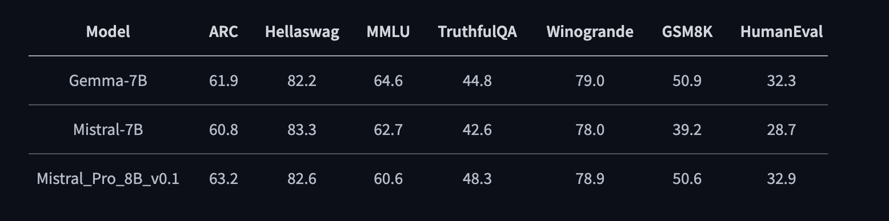

#    LLaMA Pro: Progressive LLaMA with Block Expansion
<p align="center">
📃 <a href="https://arxiv.org/abs/2401.02415" target="_blank">Paper</a> • 🤗 <a href="https://huggingface.co/TencentARC/LLaMA-Pro-8B" target="_blank">Demo & Model</a> 
</p>

## News
* [2024/01/06] We open source the [LLaMA-Pro repository](https://github.com/TencentARC/LLaMA-Pro) and [Demo & Model](https://huggingface.co/TencentARC/LLaMA-Pro-8B). 
* [2024/01/07] Add how to run gradio demo locally in [demo](./demo/app.py)
* [2024/01/18] Add the training code in [open-instruct](https://github.com/hills-code/open-instruct/tree/llama-pro).
* [2024/02/23] We release the [Mistral-Pro-8B-v0.1](https://huggingface.co/TencentARC/Mistral_Pro_8B_v0.1) with superior performance on a range of benchmarks. It enhances the code and math performance of Mistral and matches the performance of the recently dominant model, [Gemma](https://huggingface.co/google/gemma-7b).

* [2024/02/23] We release the evaluation code of [Mistral-Pro-8B-v0.1](https://huggingface.co/TencentARC/Mistral_Pro_8B_v0.1) in [lm-evaluation-harness](https://github.com/hills-code/lm-evaluation-harness).
* [2024/02/23] We release [MetaMath-Mistral-Pro](https://huggingface.co/TencentARC/MetaMath-Mistral-Pro) that surpasses previous MetaMath series 7B models at both GSM8k and MATH. The evaluation is following [the official MetaMath repo](https://github.com/meta-math/MetaMath).
* [2024/05/08] Add the pre-train example script for cosmopedia in [open-instruct](https://github.com/hills-code/open-instruct/tree/llama-pro).
* [2024/05/16] [LLaMA Pro](https://arxiv.org/abs/2401.02415) has been accepted to the main conference of ACL 2024!


🔥 Comprehensive Results

| Model               | GSM8k Pass@1 | MATH Pass@1 |
|---------------------|--------------|-------------|
| WizardMath-7B       | 54.9         | 10.7        |
| LLaMA-2-70B         | 56.8         | 13.5        |
| WizardMath-13B      | 63.9         | 14.0        |
| MetaMath-7B         | 66.5     | 19.8    |
| MetaMath-13B        | 72.3     | 22.4    |
| MetaMath-Mistral-7B | 77.7     | 28.2    |
| MetaMath-Llemma-7B  | 69.2     | 30.0    |
| 🔥 **MetaMath-Mistral-Pro** | **78.4**     | **30.3**        |

## Acknowledgement
The code of instruction tuning is based on the official implementation of [open-instruct](https://github.com/allenai/open-instruct).

Thanks [huggingface](https://huggingface.co/TencentARC/LLaMA-Pro-8B) & [wisemodel](https://wisemodel.cn/models/TencentARC/LLaMA-Pro-8B) for hosting our checkpoint.

## Citation
The code and model in this repository is mostly developed for or derived from the paper below. Please cite it if you find the repository helpful.
```
@article{wu2024llama,
  title={Llama pro: Progressive llama with block expansion},
  author={Wu, Chengyue and Gan, Yukang and Ge, Yixiao and Lu, Zeyu and Wang, Jiahao and Feng, Ye and Luo, Ping and Shan, Ying},
  journal={arXiv preprint arXiv:2401.02415},
  year={2024}
}
```
